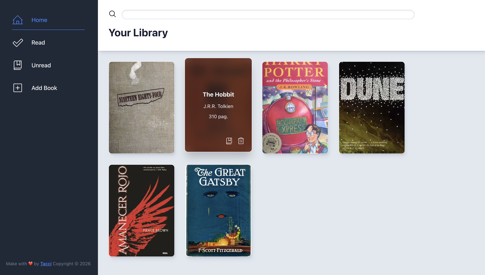

# Library App

> A personal library manager built with HTML, CSS and JavaScript. Add books, track your reading progress and browse covers fetched automatically from the Open Library API.

---

## 🔗 Live Demo

**Live Demo:** [taaccii.github.io/library](https://taaccii.github.io/library-app/)

---

## ✨ Features

- **Book cards** — cover art fetched automatically from the Open Library API, with a fallback avatar generated from the title
- **Hover overlay** — title, author, page count and action buttons revealed on hover with a frosted-glass backdrop-filter effect
- **Read / Unread toggle** — mark books as read or unread with a single click; icon and color update instantly
- **Sidebar filtering** — filter your library by All, Read or Unread via the animated sidebar navigation
- **Add book modal** — native `<dialog>` element with slide-up animation and blurred backdrop
- **Remove with animation** — books fade and scale out before being removed from the DOM
- **Empty state** — context-aware messages when a filtered view returns no results
- **CSS Custom Properties** — fully themed with variables for colors, shadows and border radius
- **Josh Comeau shadow palette** — realistic multi-layer shadows with HSL color tinting
- **Responsive** — sidebar collapses to icon-only on mobile, dialog resizes for small screens

---

## 🛠️ Tech Stack

| Component | Technology |
|-----------|------------|
| **Markup** | HTML5 |
| **Style** | CSS3 |
| **Logic** | JavaScript (ES6+) |
| **Layout** | CSS Grid + Flexbox |
| **Icons** | Phosphor Icons (SVG inline) |
| **Font** | System font stack (Roboto) |
| **Cover API** | Open Library Covers API |
| **Fallback** | ui-avatars.com |
| **Shadows** | Josh Comeau Shadow Palette |

---

## 💡 What I Learned

- Using constructor functions and `prototype` to model data (`Book`, `toggleRead`)
- Managing application state with a plain array and re-rendering on every change
- Fetching data asynchronously with `fetch` and the Open Library Search API
- Handling async operations in parallel with `Promise.all` for the initial book load
- Working with the native `<dialog>` element and its `showModal()` / `close()` API
- Dynamically building and injecting DOM nodes with `createElement` and `appendChild`
- Parsing inline SVG strings with `DOMParser` to inject icons programmatically
- CSS `backdrop-filter` for the frosted-glass overlay effect on book cards
- CSS `@keyframes` for entrance animations (`slideUp`, `fadeIn`) and exit transitions (`fade-out`)
- Generating unique IDs with `crypto.randomUUID()` for reliable item tracking
- Responsive layout with CSS Grid and a collapsing sidebar using media queries

---

## 📝 Notes

This was my first project to combine DOM manipulation, asynchronous JavaScript and a real external API. The trickiest part was coordinating the async cover fetching — especially loading multiple books in parallel at startup with `Promise.all` while keeping the UI responsive. I also spent time on the interaction details: the overlay hover effect, the read-toggle animation and the smooth card removal all required careful layering of CSS transitions and JavaScript timing. Designing the frosted-glass overlay entirely in CSS without any library was a satisfying challenge.

---

## 📄 License

This project is licensed under the **MIT License** — see [`LICENSE`](./LICENSE) for details.

---

## 👨‍💻 Author

**Taaccii**

- 📧 [taccidev@gmail.com](mailto:taccidev@gmail.com)
- 🐙 GitHub: [@Taaccii](https://github.com/Taaccii)
- 💼 LinkedIn: [alessandro-barletta-dev](https://linkedin.com/in/alessandro-barletta-dev)

---

> *Project built as part of [The Odin Project](https://www.theodinproject.com/) JavaScript curriculum.*